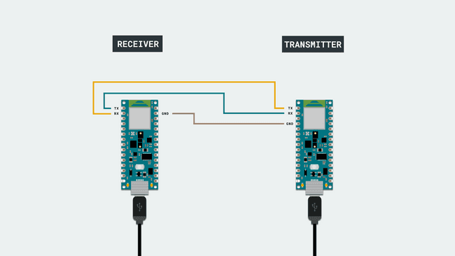
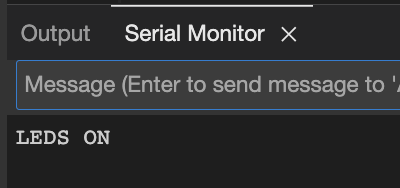
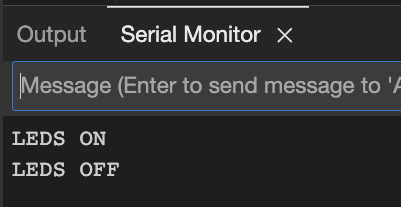
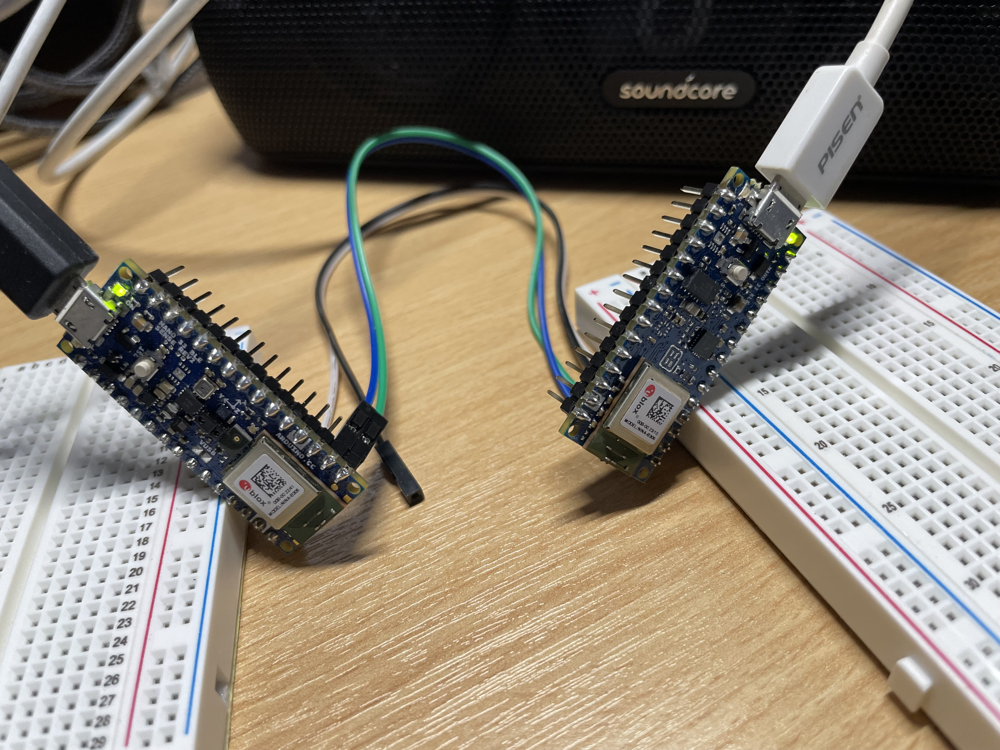
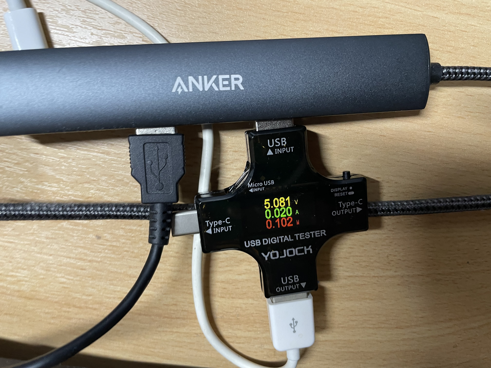

#Arduino Ensemble 5 ID for Power Measurement

This project is designed as an extension for previous Arduino Ensemble 5 ID design.

The aim is to have a fairly accurate power consumption for the Arduino board.

## 2 Jan

Will start by two objectives:

+ Connect two boards by UART
+ Modify previous design to be adapted to the external UART connection

### Objective interconnection

There is a good tutorial about connecting two boards using UART

[Connecting Two Nano 33 BLE Sense Boards Through UART](https://docs.arduino.cc/tutorials/nano-33-ble-sense/uart)

What we need:

+ Arduino Nano 33 BLE sense
+ Arduino Nano 33 BLE Sense (or any other Arduino board that works at 3.3V)
+ 2 X mini breadboards
+ 3 X jump wires

I have prepared another Arduino Nano 33 BLE as the bridge.

The circuits should look like this

## 8 Jan

Today I want to continue carrying on the exploration on the arduino implementation.

Now reading the tutorial.

Realised that I need to create two projects to configure receiver and transmitter respectively becsue Arduino IDE does not allow two ino files in one project.

Finished the configuration for two boards and the test could be seen here:

### Testing

#### Hiccups

Noticed that the response on the terminal is not really responsing everytime, thought it might be the connection issue, so I replaced the connection from male to male to female to female and then the issue is resolved.

#### Turn the boards on

Tried to turn the board LED on by sending "1":

Tow boards recognised the transmitted information "1" by lighting up the LED (transmitter on the right, receiver on the left)

_and_receiver(left)_on_8_Jan.jpeg)

#### Turn the boards off

Tried to turn the board LED off by sending "0":

Two boards recognised that information sent over is "0" by turning off the LED

Following this, I should be able to adapt the old TinyML application to a standalone implementation to measure the power while doing the inference.

Managed to capture the power consumption while running the mini programme implemented above, which gives me 102 mW:

